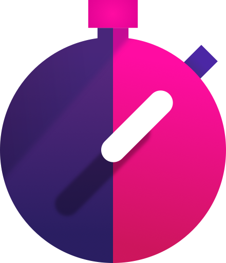

# TimeTracker

TimeTracker is a basic Compose-based Android app heavily inspired by the iOS app [Timery](https://timeryapp.com) by [Joe Hribar](https://twitter.com/joehribar)
as part of my SENG440 Mobile Developement course.

Both use the Toggl Track time tracking API backend, although TimeTracker uses the newer, non-deprecated (but worse) API.

It can:

- Show existing entries
- Start existing entries beginning from the current time
- Resume the most recently stopped entry
- Allow existing entries to be modified
- Create new entries
- Delete entries

It cannot:

- Create new projects or tags
- Create 'Saved Timers'
- View statistics
- Work with organizational workspaces

The app has been tested down to Android 6.

